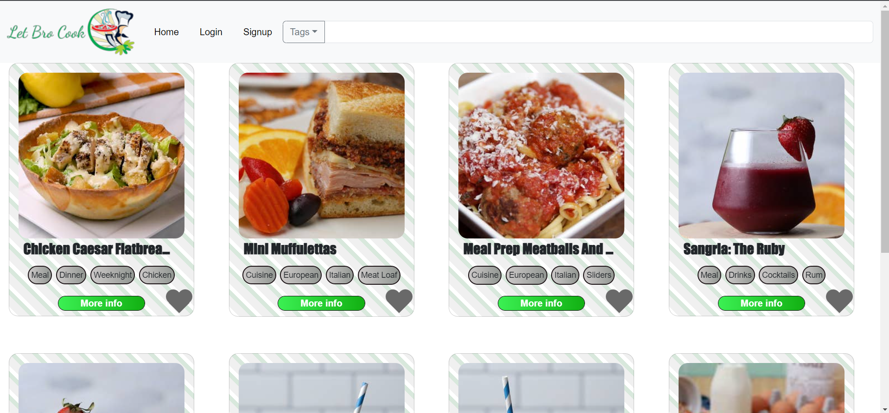
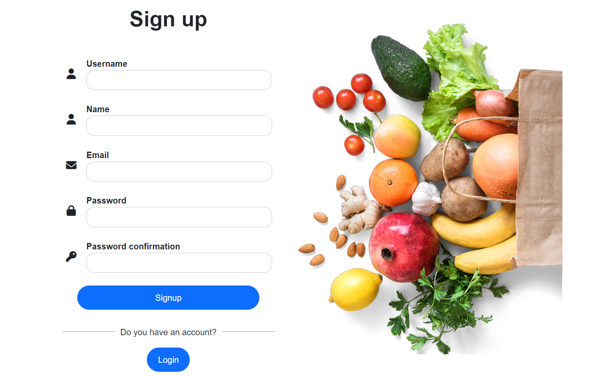

<div align="center">
  
  &nbsp;&nbsp;&nbsp;
  
  &nbsp;&nbsp;&nbsp;
   
  &nbsp;&nbsp;&nbsp;
</div>


### Purpose

The aim of our project is to create a website where users can share and view recipes essentially. Viewers will need to sign, create an account. Then users are free to browse our catalog of recipes. Each recipe has numerous descriptive elements we call “tags'' that inform users who are viewing a recipe what it contains. Example tags could be “vegan”, “breakfast”,”cheap” etc. Moreover users can leave reviews on each recipes. 

## Prequistes:
* Git
* NodeJS
* python with all the modules in the files
## Getting started
```bash
# Clone repository
git clone git@git.chalmers.se:courses/dit342/group-00-web.git

# Change into the directory
cd group-00-web

# Setup backend
cd server && npm install
npm run dev

# Setup frontend
cd client && npm install
npm run serve
```

> Check out the detailed instructions for [backend](./server/README.md) and [frontend](./client/README.md).

## Visual Studio Code (VSCode)

Open the `server` and `client` in separate VSCode workspaces or open the combined [backend-frontend.code-workspace](./backend-frontend.code-workspace). Otherwise, workspace-specific settings don't work properly.

### Main features:
* Dynamic and responsive UI no matter the screen size.
* A UI designed with user convience at the forefront implemented by flipping a recipe card to views its details.
* Over 800 recipes
* A recommendation written in python as a microservice that utilizies collaborative filtering techniques 


## The website
Home Page Desktop



Signup page


